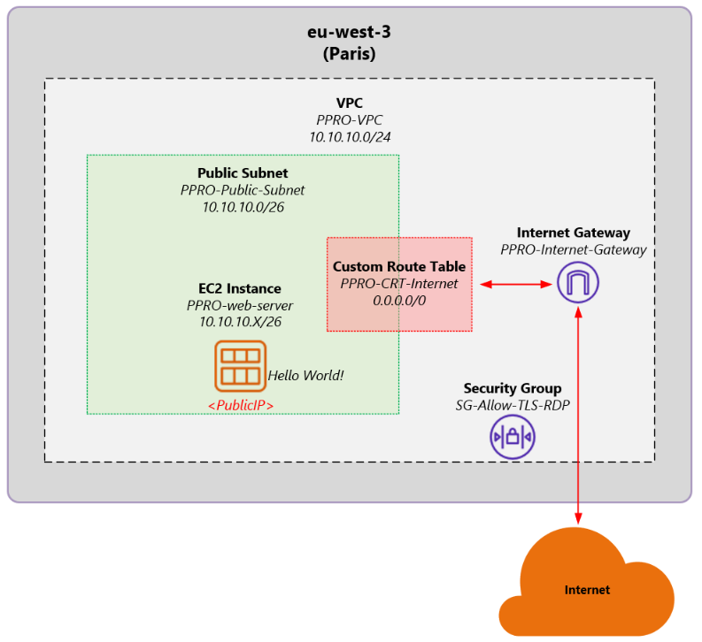

# README File <a name="readme-top"></a>


<!-- PROJECT LOGO -->
<br />
<div align="center">
  <a href="https://github.com/esanchezgomez/network-challenge">
    
  </a>

<h3 align="center">PPRO DevOps + Network Engineering Challenge</h3>

  <p align="center">
    Repository to create an AWS Network Infrastructure (VPC, Subnet, Internet Gateway, Custom Route Table, Security Group) as well as an Ubuntu EC2 with a Hello World application using Terraform Infrastructure as Code (IaC)
    <br />
    <br />
    <a href="https://github.com/esanchezgomez/network-challenge/blob/main/ec2.tf">EC2 Ubuntu IaC</a>
    ·
    <a href="https://github.com/esanchezgomez/network-challenge/blob/main/vpc.tf">AWS Network IaC</a>
    ·
    <a href="https://github.com/esanchezgomez/network-challenge/blob/main/key-pair-main.tf">Private/Public Keys IaC</a>
  </p>
</div>


<!-- TABLE OF CONTENTS -->
<details>
  <summary>Table of Contents</summary>
  <ol>
    <li>
      <a href="#about-the-project">About The Project</a>
    </li>
    <li>
      <a href="#getting-started">Getting Started</a>
      <ul>
        <li><a href="#prerequisites">Prerequisites</a></li>
      </ul>
    </li>
    <li><a href="#usage">Usage</a></li>
      <ul>
        <li><a href="#verification">Verification</a></li>
      </ul>
      <ul>
        <li><a href="#testing">Testing</a></li>
      </ul>
      <ul>
        <li><a href="#destroy-the-infrastructure">Destroy the Infrastructure</a></li>
      </ul>
    <li><a href="#license">License</a></li>
    <li><a href="#acknowledgments">Acknowledgments</a></li>
  </ol>
</details>


<!-- ABOUT THE PROJECT -->
## About The Project

This GitHub Repository contains all the necessary Terraform code to create the following AWS resources:
* A VPC
* A public subnet within that VPC
* An internet gateway
* A Custom Route Table (CRT) with a default route for internet access
* Association between the public subnet and the CRT
* A Security Group to allow TLS (443) and HTTP (80) access to an EC2 instance
* A key pair (public and private) for access into an EC2 instance
* An EC2 instance (ubuntu) with a public IP running a simple Hello World application

<p align="center"></p>

<p align="right">(<a href="#readme-top">back to top</a>)</p>


<!-- GETTING STARTED -->
## Getting Started

Before you start, read this README file carefully. Below you will see the prerequisites as well as installation instructions to make this project work.

### Prerequisites

For this project you will need:
* A <strong>GitHub account</strong> to be able to clone this repository
* Have <strong>Terraform installed</strong>. Instructions how to install Terraform on Windows, Mac and Linux devices can be found <a href="https://learn.hashicorp.com/tutorials/terraform/install-cli">here</a>
* An <strong>AWS account</strong> with AWS Access Credentials. 

If you don't have AWS Access Credentials, create your <strong>AWS Access Key ID</strong> and <strong>Secret Access Key</strong> by navigating to your IAM security credentials in the AWS console. Click "Create access key" here and download the file. This file contains your access credentials.

<p align="right">(<a href="#readme-top">back to top</a>)</p>


<!-- USAGE EXAMPLES -->
## Usage

Follow these steps in order to implement the code.

1. In your device, create the folder structure where you will clone this repository to
2. Clone the repo. You can use for example <strong>Git Bash</strong> to do this.
   ```sh
   git clone https://github.com/esanchezgomez/network-challenge.git
   ```
3. For Terraform to be able to make changes in your AWS account, you will need to set the AWS credentials (as mentioned in the prerequisites) as the environment variables. 
   <br />
   <br />
   Here is how to do it in a Linux or MacOS terminal:
   ```sh
   $ export AWS_ACCESS_KEY_ID=(your access key id)
   $ export AWS_SECRET_ACCESS_KEY=(your secret access key)
   ```
   Here is how to do it in a Windows PowerShell terminal:
   ```sh
   $ set AWS_ACCESS_KEY_ID=(your access key id)
   $ set AWS_SECRET_ACCESS_KEY=(your secret access key)
   ```
   Note that these environment variables apply only to the current shell, so if you reboot your computer or open a new terminal window, you will need to export these variables again.
   <br />
   <br />
4. Within that same terminal window, go into the folder where the repo is located
5. Run the command `terraform init` to initialize Terraform and figure out which providers the code is using
6. Run the command `terraform plan` to see what Terraform will do before actually making any changes
7. Run the command `terraform apply` to create all the AWS resources, including the EC2 instance

### Verification

Login to your AWS account and verify that the following resources have been created:

1. <strong>PPRO-VPC</strong> with a network of <strong>10.10.10.0/24</strong>
2. <strong>PPRO-Public-Subnet</strong> with a subnet value of <strong>10.10.10.0/26</strong>
3. <strong>PPRO-CRT-Internet</strong> with a default route <strong>0.0.0.0/0</strong>
4. <strong>PPRO-Internet-Gateway</strong> attached to the VPC
5. <strong>SG-Allow-TLS-RDP</strong> with 3 <strong>inbound rules</strong>
    * Allow HTTPS (tcp 443) from any
    * Allow HTTP (tcp 80) from any
    * Allow RDP (tcp 3389) from any
6. <strong>PPRO-web-server</strong> with a public IP address

### Testing

In order to test the small <strong>Hello World</strong> application running in the EC2 instance, do the following:

1. From your AWS console, select the <strong>PPRO-web-server</strong> and under "Details" you will see its public IP address
2. Copy that IP address and paste it in your web browser. Make sure that it is "http://" and not "https://" and add the port number 80. Example:
   ```sh
   http://<publicIP>:80
   ```

You should see the message <strong>Hello PPRO World! Nice to meet you!</strong>

### Destroy the Infrastructure

As a recommended last step, once you are done with testing, you should destroy all of the AWS resources you just created. Unless of course, this is for a production environment.

In order to do this, simple run the command `terraform destroy`

<p align="right">(<a href="#readme-top">back to top</a>)</p>


<!-- LICENSE -->
## License

No License is needed for this project. 

<p align="right">(<a href="#readme-top">back to top</a>)</p>
